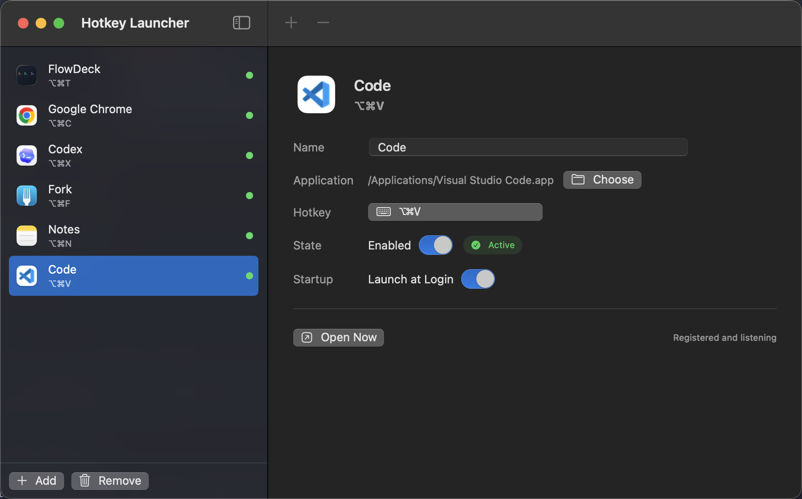

# 热键启动器

热键启动器是一个原生 macOS 热键启动工具，使用 SwiftUI、AppKit 和 Carbon 全局热键构建。你可以为任意应用分配一个全局热键，并在任何位置快速切换或打开它。

运行需要 macOS 12 或更高版本。从源码构建需要 Swift 5.7 或更高版本。



## 功能

- 通过 Carbon 注册系统级全局热键
- 侧边栏展示快捷方式列表，并实时显示注册状态
- 菜单栏入口支持启动快捷方式和重新打开主窗口
- 设置页支持 **登录时启动** 和窗口激活行为
- 可选择是否在程序坞（Dock）和应用切换器中显示
- 支持将快捷方式与全局设置作为 JSON 配置包导入、导出
- 支持在应用内检查更新，并从 GitHub Releases 下载新版

## 安装

从 [GitHub Releases](https://github.com/zjy4fun/HotkeyLauncher/releases) 下载最新 DMG，打开后将 **HotkeyLauncher.app** 拖入 **Applications**。

发布包使用 ad-hoc 签名，没有 Apple Developer ID。因此通过浏览器下载后，Gatekeeper 可能提示无法验证开发者。可以右键点击应用并选择一次 **打开**，也可以清除隔离标记：

```bash
xattr -dr com.apple.quarantine /Applications/HotkeyLauncher.app
```

通过应用内更新（设置 → 更新 → 下载）不会设置隔离标记，因此应用内下载的更新通常不会出现这个提示。

## 构建和运行

```bash
./script/build_and_run.sh
```

快捷方式保存位置：

```text
~/Library/Application Support/HotkeyLauncher/shortcuts.json
```

全局设置保存位置：

```text
~/Library/Application Support/HotkeyLauncher/settings.json
```

## 设置

启用 **无可见窗口时新建窗口** 后，该行为会应用到所有快捷方式。当目标应用已运行但没有可见的普通窗口时，热键启动器会激活它并发送 `Command+N`，让 Chrome 这类应用创建新窗口，而不是看起来没有任何响应。macOS 可能会要求你授予热键启动器辅助功能权限，才能发送这个按键。

关闭 **在程序坞（Dock）中显示** 后，应用会保留菜单栏图标和热键监听能力，但不会出现在程序坞或应用切换器中。需要重新打开主窗口时，可以点击菜单栏图标。

可以在设置页使用 **导入** 和 **导出**，在不同设备之间迁移快捷方式和全局设置。导出的文件是一个 JSON 配置包，包含快捷方式列表和应用级设置。

设置页的 **更新** 区域会显示当前应用版本，并可检查 GitHub Releases 是否存在新版本。GitHub workflow 生成的发布包会写入标签版本，上传 DMG，并发布用于更新检查的 `latest.json` 元数据。分支构建会将生成的 DMG 作为 GitHub Actions 构建产物上传。

## 默认快捷方式

- `Option+Command+T` -> `/Applications/FlowDeck.app`
- `Option+Command+C` -> `/Applications/Google Chrome.app`
- `Option+Command+X` -> `/Applications/Codex.app`
- `Option+Command+F` -> `/Applications/Fork.app`
